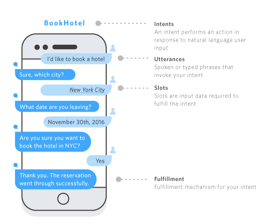

i# amazon-ai-building-better-bots

Code samples related to [Building Better Bots](https://aws.amazon.com/blogs/ai/building-better-bots-part-2/) published on the AWS ML Blog.

# CoffeeBot chat bot

CoffeeBot is a transactional chat bot that can help you order a coffee.  

This tutorial will help you build CoffeeBot using Amazon Lex and Lambda so you can have a conversation like the following:

> User:  May I have a mocha? <br/>
> CoffeeBot:  What size?  small, medium, large? <br/>
> User:  small <br/>
> CoffeeBot:  Would you like that iced or hot? <br/>
> User:  hot <br/>
> CoffeeBot:  You'd like me to order a small mocha.  Is that right? <br/>
> User:  Make it a large mocha <br/>
> CoffeeBot:  You'd like me to order a large mocha.  Is that right? <br/>
> User:  yeah <br/>
> CoffeeBot:  Great! Your mocha will be available for pickup soon. Thanks for using CoffeeBot!

## Building an Amazon Lex chat bot

To build our chat bot, we're going to utilize several new constructs including `intents`, `utterances`, `fulfillment` and `slots`.  Each of these constructs serve a different purpose in allowing Lex to understand how to interact with a user.

The following diagram provides an overview of the main components and how Amazon Lex utilizes them:

<div style="text-align:center"></div>

Now that we're aware of the components of an Amazon Lex chat bot, lets build one!

### 1. Create the bot

From within the AWS console, navigate to the `Amazon Lex` service console, and click `Create` and then select `Custom bot` to create a new bot.  Enter the following settings for your bot:

Setting | Value
------- | -----
Bot name |  `CoffeeBot`
Output voice |  Choose any voice
Session timeout |  `5 min`
Sentiment Analysis | `No`
IAM role |  `AWSServiceRoleForLexBots`
COPPA |  `No`

Note: If you are sharing an AWS account with others, append your initials to the bot name to make it unique (e.g., `CoffeeBotXXX`)

### 2. Create an intent

Using the left-hand menu under 'Intents' click the `+` button to add a new Intent called `cafeOrderBeverageIntent`, click 'Add' to save the Intent.  Once the Intent is created, add the below list of 'utterances' to your newly created Intent by placing them one-at-a-time into the 'Sample utterances' entry box and clicking `+` or pressing 'Enter' to save each.  
Note: If you are working in a shared AWS account with others, append your initials to the Intent name so each is unique (e.g., `cafeOrderBeverageIntentXXX`).

Utterances |
---------- |
I would like a {BeverageSize} {BeverageType} |
Can I get a {BeverageType} |
May I have a {BeverageSize} {Creamer} {BeverageType} |
Can I get a {BeverageSize} {BeverageTemp} {Creamer} {BeverageType} |
Let me get a {BeverageSize} {Creamer} {BeverageType} |


### 3. Create slot types

Using the left-hand menu under 'Slot types' click the `+` button to add a new slot type.  Select 'Create slot type' in the popup window to create a custom slot type.  Enter the 'Slot type name' and then add each value seperately from the 'Values' column of the table below.  To add each value to your slot type, click the `+` button next the the value entry box or press 'enter'.  When you have entered all the values for the slot type you are working on, click the `Add slot to intent` button.  You should have created 4 slot types in total.

Note:  Although they are saved with the AWS Account, Slot Types will not show up in the list until they are associated in the next step.
If you are working in a shared AWS account with others, append your initials to the Slot type name so each is unique.

Slot type name | Description | Slot resolution | Values (each entry on a separate line)
-------------- | ----------- | --------------- | --------------------------------------
`cafeBeverageType` | *Slot types are shared at the account level so text would help other developers determine if they can reuse this Slot type.*| default | `coffee` <br/> `cappuccino` <br/> `latte` <br/> `mocha` <br/> `chai` <br/> `espresso` <br/> `smoothie`
`cafeBeverageSize` | | default |  `kids` <br/> `small` <br/> `medium` <br/> `large` <br/> `extra large` <br/> `six ounce` <br/> `eight ounce` <br/> `twelve ounce` <br/> `sixteen ounce` <br/> `twenty ounce`
`cafeCreamerType` | | default | `two percent` <br/> `skim milk` <br/> `soy` <br/> `almond` <br/> `whole` <br/> `skim` <br/> `half and half`
`cafeBeverageTemp` | | default | `kids` <br/> `hot` <br/> `iced`

### 4. Add slots to the intent
Under the 'Slots' section of your CoffeeBot, add the following entries to the list of Slots by choosing the Slot type from the drop down selection, entering a 'Name' and completing the 'Prompt'.  Click the `+` button to add the Slot to the Intent.

Note: You will not see the 'Required' field until you have added the Slot.

Required | Name            | Slot type | Prompt
-------- | --------------- | --------- | -------------
`Yes` | `BeverageType` | `cafeBeverageType` | `What kind of beverage would you like?  For example, mocha, chai, etc.`
`Yes` | `BeverageSize` | `cafeBeverageSize` | `What size?  small, medium, large?`
 &nbsp;| `Creamer` | `cafeCreamerType` | `What kind of milk or creamer?`
 &nbsp;| `BeverageTemp` | `cafeBeverageTemp` | `Would you like that iced or hot?`

### 5. Set the confirmation prompt

Expand the 'Confirmation prompt' section and check the box for 'Confirmation prompt'.  Add the following confirmation prompts:

Confirmation type | Description
----------------- | -----------
Confirm | You'd like me to order a `{BeverageSize}` `{BeverageType}`. Is that right?
Cancel | Okay. Nothing to order this time. See you next time!

### 6. Define fulfillment

Under the `Fulfillment` section, choose `Return parameters to client` for simple testing.  This setting will change later.

### 7. Define responses

Expand the `Response` section and select `Add Message` to add the following closing message to the intent.

#### Response message
```
Thank you. Your {BeverageType} has been ordered.
```

Click the `+` button to add the response.  Check the checkbox 'Wait for user reply' and enter the following message, clicking the `+` when you are finished:

#### Wait for user reply message
```
OK. Thank you. Have a great day!
```

Click the 'Save Intent' button at the bottom of the page.

### 8. Review the error handling settings
After saving the Intent, select 'Error Handling' from the left-hand side menu.  Make sure the `Clarification prompt` and `Hang-up phrase` are both present and that the 'Maximum number of retries' is set to `2`.

Error Handling Prompt | Message
--------------------- | -------
Clarification prompts | Sorry, can you please repeat that?
Maximum number of retries | 2
Hang-up phrase | Sorry, I could not understand. Goodbye.

Click 'Save' when you have confirmed your settings match those above.

### 9. Build and test the bot
Build the chatbot by clicking the `Build` button at the top right of the console. Once the build is complete, you'll be able to test the bot with the utterances you've entered above.  The 'Test bot' panel on the right-hand side will allow you to chat with your bot in the 'Chat with your bot...' entry box.

For example, if you say `May I have a chai?`, does Lex correctly map `chai` to the `BeverageType` slot?

## Create a Lambda function

To handle more complex logic, we can link our chat bot to a Lambda function to process the user's interaction with the bot and create action based responses.

### Create the function

1. Open the 'AWS Lambda' service in a new tab in your browser.  It may help to duplicate your existing tab.
1. From the AWS Lambda console, click the `Create function` button at the top right.
1. Select `Author from scratch` under the `Create function` page.
1. Set the following values under the `Basic information` section of the Lambda:
   1. 'Function name' = `cafeOrderCoffee`
   2. 'Runtime' = `Node.js 12.x`
2. Under the `Permissions` header, expand the `Choose or create an execution role` section.
3. Under the `Execution role` header, select `Create a new role with basic Lambda permissions`
4. Click `Create function` at the bottom of the page to create the Lambda.
5. Once the Lamba editor page has loaded, scroll to the `Function code` and remove all the default code in the editor
6. Replace the content of the function code [with the example code here](https://github.com/aws-samples/amazon-ai-building-better-bots/blob/master/src/index.js)

### Create a test event to validate the function

1. Click the dropdown next to the `Test` button with the text 'Select a test event'.  Select `Configure test events` from the dropdown.
2. Enter `cafeOrderTest` as a name for your test event in the `Event Name` field.
3. Replace the test event JSON with the [sample event JSON](https://github.com/aws-samples/amazon-ai-building-better-bots/blob/master/test/cafeOrderCoffee_test.json)
4. Click `Create`
5. Click `Test` to run the function test and review the output in the 'Execution results' in the code editor area.

## Update the bot to use the Lambda
Now that we have processing logic in the Lambda, we'll associate the Lambda with the bot so that the code gets executed when we interact with CoffeeBot.

1. Navigate to the `Amazon Lex` console adn select the `CoffeeBot` bot from the `Bots` list
2. Make sure `Latest` is selected from the version drop down next to the `cafeOrderBeverageIntent`
3. Expand the `Lamda initialization and validation` section and check the `Initialization and validation code hook` checkbox
4. In the `Lambda function` drop down, select the `cafeOrderCoffee` Lambda function and leave the `Version or alias` as `Latest`
  1. If prompted, allow Amazon Lex to call your new function
5. Expand the `Fulfillment` section and select the `AWS Lambda function` radio button
6. Select the `cafeOrderCoffee` Lambda function from the `Lambda function` drop down and leave the `Version or alias` as `Latest`
7. Click `Save Intent` at the bottom of the screen
8. Rebuild the Chat bot by clicking the `Build` button at the top of the screen

Now that the Lambda is connected to the CoffeeBot and is re-built to use the Lambda, test the new responses by chatting with the bot in the `Test bot` dialog on the right hand side of the screen.

For example, ask the bot for a coffee:

`Can I get a coffee?`

Notice that the bot responds differently.  It is now referencing the logic in the Lambda function to validate the input and respond back accordingly.

## Errors
If you have this error: "The checksum value doesn't match for the resource named..." then a page refresh is required - the build should work as normal after this.

## AWS Amplify

When you're ready, try out [AWS Amplify](https://aws-amplify.github.io/docs/js/interactions) for bringing your chatbot to a mobile or web environment.

